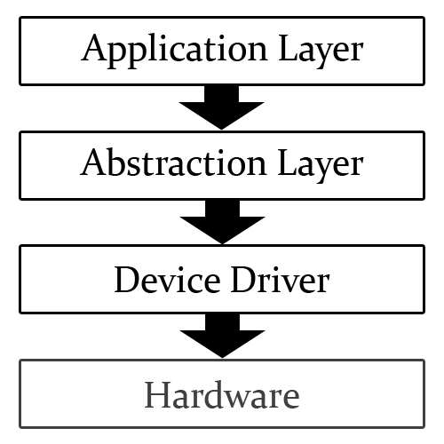

이글은 [https://openglbook.com/chapter-0-preface-what-is-opengl.html](https://openglbook.com/chapter-0-preface-what-is-opengl.html)을 참조하여 만들어 졌습니다.

## openGl의 시작

1981년 설립된 실리콘 그래픽스 회사에 의하여 IRIS GL(Integrated Raster Imaging System Graphical Library) 라이브러리가 만들어 지며  
1990년대의 그래픽스 개발의 시작을 알리게 되었다.

1990초 SGI는 3D그래픽 시장을 선도 하였고 그로인해 산업 표준의 3D그래픽 라이브러리가 되었다.

1992 년 ```IRIS GL``` 에서 그래픽스와 관련없는 기능을 제가하고 개선하여 OpenGL(Open Graphics Library)이라는 표준화 API를 발표 하였습니다.


## window opengl

window 는 opengl과의 호환성 문제가 많이 있엇으며 Microsoft는 이에 대하여 새로운 3d 그래픽 api를 만들었습니다.

그리하여 window는 ```DIRECT X``` 로 graphic api를 사용하게 되었습니다.

## 하드웨어의 변화

1999년대 NVIDIA 가 GPU라는 이믈의 Geforce 에드온 그래픽 카드를 출시하였고 T$L 라는 새로운 기술을 지원 하게 되었습니다

이는 정점 변환 계산과 조명 계산을 컴퓨터의 CPU를 사용하지 않고 GPU를 사용하게 되는 계기가 되었다.

## GPU가 다한다

2000년 초반 GPU가 CPU작업을 가져가면서 GPU는 CPU와는 다른 길을 걷게 되었습니다.

### 버퍼

Ram에 저장된 데이터를 GPU가 연상을 하기위하여 불러오는데 너뭄많은 시간이 걸리는 데 gpu에서 vertex buffer objects(VBO) 를 사용하여 보다 빠른방식으로 데이터를 저장하고 사용하게 되었습니다.

### 셰이더
2003년 Microsoft는 Direct3D 에 HLSL를 발표하였습니다. c언어로 셰이더를 조작할 수 있게 되었습니다

> [!NOTE]
> 추측인데 그전까진 고급 언어로 작업한게 아닌거 같다 👀


###  "Longs Peak"와 "Mt. Evans"

OpenGL은 2007년 새로운 작업환경 "Longs Peak" 를 출시하였고 몇 달 후 "Mt. Evans" 출시를 하였습니다.


### opengl 3.0 의 몰락

opengl은 cad의 호환성을 위하여 오래된 기능들을 지울 수 없었고 새로운 환경에 대한 적응에 대한 장애물이 되었다.

이러한 opengl에 비해 direct3d는 릴리스가 잘되고 최신 기능들이 적용되면서 opengl에대한 많은 유저가 direct3d로 전환하였다.


### openGL4,0

최신 세대의 GPU를 지원하기위한 새로운 API를 지원하게 되었다

새로운 기능도 생겼는데 테셀레이션이라는 기능이며 장면의 세밀한 조정을 자동하 하는 기능이다.

이러한 openGL의 기능으로 현재 ```iphone``` 과 ```android``` 도 openGL 기반인 openGL ES 를 사용한다.

웹표준을 위한 API로 openGL ES를 기반한 webGL이라는  API를 만들었다.

## 소프트웨어 파이프라인

실시간 컴퓨터 그래픽을 렌더링할 때 소프트웨어 파이프라인은 다음과 같은 순서를 통한다



### appliaction

opengl or Direct3D 호출, 창, 스레드, 메모리 할당, 사용자의 데이터 유형 생성 등을 작업한다

### Abstraction Layer

기능을 정의하여 만든다. 명령을 하드웨어 장치 드라이버에 전달하며 소프트웨어에 따라 처리가 된다.

> [!TIP]
> 코드 생성이라 생각하면 될거 같다

### Device Driver

전달받은 멸령을 해석하고 작업을 처리할수 있게 장치에 전달합니다.

> [!TIP]
> 컴파일 단계라 생각하면 될거 같다.

### Hardware

명령된 작업을 처리하여 반환해 줍니다.

