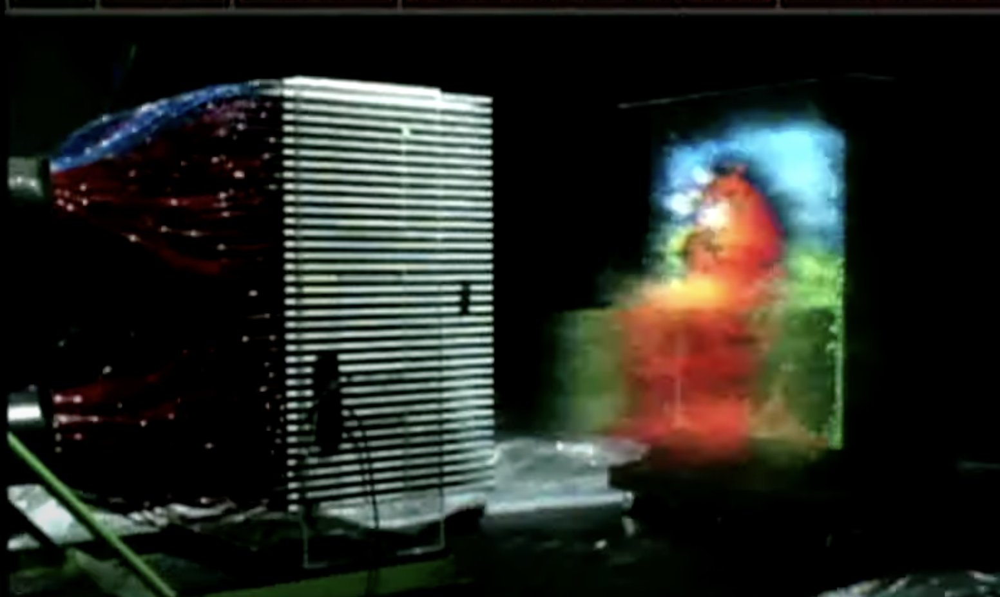

## opengl 시작하기

💻 노트북 : macbookair(m1)

필자는 다음과 같은 사항으로 코드를 수정하여 작성하였다

> [!CAUTION]
> x11 지원 중단으로 인한 xquartz 설치가 필요해서 필자는 ```freeglut``` 라이브러리를 사용하지 않았다

다음과 같은 라이브러를 설치하였다

```bash
brew install glfw
```


```bash
$ brew list              
==> Formulae
glfw

==> Casks

$ brew info glfw
==> glfw: stable 3.4 (bottled), HEAD
Multi-platform library for OpenGL applications
https://www.glfw.org/
Installed
/opt/homebrew/Cellar/glfw/3.4 (16 files, 861KB) *
  Poured from bottle using the formulae.brew.sh API on 2025-02-13 at 20:02:34
From: https://github.com/Homebrew/homebrew-core/blob/HEAD/Formula/g/glfw.rb
License: Zlib
```


코드는 다음과 같다 

```c filepath='main.c'
#include <stdlib.h>
#include <stdio.h>
#include <GLFW/glfw3.h>

#define WINDOW_TITLE_PREFIX "Chapter 1"

int CurrentWidth = 800,
    CurrentHeight = 600;

GLFWwindow *window;

void Initialize(int, char *[]);
void InitWindow(int, char *[]);
void ResizeFunction(GLFWwindow *, int, int);
void RenderFunction(void);

int main(int argc, char *argv[])
{
  // input 값 정의
  Initialize(argc, argv);

  while (!glfwWindowShouldClose(window))
  {
    RenderFunction();
    glfwPollEvents();
  }

  glfwDestroyWindow(window);
  glfwTerminate();

  exit(EXIT_SUCCESS);
}

void Initialize(int argc, char *argv[])
{
  InitWindow(argc, argv);

  fprintf(stdout, "INFO: OpenGL Version: %s\n", glGetString(GL_VERSION));

  glClearColor(0.0f, 0.0f, 0.0f, 0.0f);
}

void InitWindow(int argc, char *argv[])
{
  // opengl 기본정의
  if (!glfwInit())
  {
    fprintf(stderr, "ERROR: GLFW initialization failed\n");
    exit(EXIT_FAILURE);
  }

  // 맥스 버전
  glfwWindowHint(GLFW_CONTEXT_VERSION_MAJOR, 4);
  // 최소 버전 정의
  glfwWindowHint(GLFW_CONTEXT_VERSION_MINOR, 0);
  
  glfwWindowHint(GLFW_OPENGL_PROFILE, GLFW_OPENGL_CORE_PROFILE);

  // 창 생성
  window = glfwCreateWindow(CurrentWidth, CurrentHeight, WINDOW_TITLE_PREFIX, NULL, NULL);
  if (!window)
  {
    fprintf(stderr, "ERROR: Could not create a new rendering window.\n");
    glfwTerminate();
    exit(EXIT_FAILURE);
  }

  glfwMakeContextCurrent(window);
  glfwSwapInterval(1); // V-Sync

  // 리사이즈 함수 등록
  glfwSetFramebufferSizeCallback(window, ResizeFunction);
}

void ResizeFunction(GLFWwindow *window, int Width, int Height)
{
  CurrentWidth = Width;
  CurrentHeight = Height;
  glViewport(0, 0, CurrentWidth, CurrentHeight);
}

void RenderFunction(void)
{
  glClear(GL_COLOR_BUFFER_BIT | GL_DEPTH_BUFFER_BIT);

  // 화면 출력
  glfwSwapBuffers(window);
}
```

```makefile filepath='Makefile'
INCLUDES = -I/opt/homebrew/include
LIBPATHS = -L/opt/homebrew/lib

CFLAGS = -Wall -Wextra $(INCLUDES)

LIBS = $(LIBPATHS) -lGL -lGLEW -lglfw

SRCS = main.c

TARGET = openglstarter

all: $(TARGET)

$(TARGET): $(SRCS)
	$(CC) $(CFLAGS) -o $(TARGET) $(SRCS) $(LIBS)

clean:
	rm -f $(TARGET)

```

## 코드 분석

> [!IMPORTANT]
> 상위 코드를 하나하나 분석해 보도록 하겠다

## glfw 정의하기

```c
  // opengl 기본정의
  if (!glfwInit())
  {
    fprintf(stderr, "ERROR: GLFW initialization failed\n");
    exit(EXIT_FAILURE);
  }
```

다음 ```glfwInit()```함수로 opengl 을 정의하여 시작하는 것으로 시작전 꼭 필요한 선언이다.

### glfwWindowHint()

```glfwWindowHint()``` 함수에서 설정할 수 있는 주요 hint 항목들은 다음과 같습니다

| 정의 | 설명 |
| --- | --- |
| **GLFW_CONTEXT_VERSION_MAJOR / GLFW_CONTEXT_VERSION_MINOR** | OpenGL의 주 버전과 부 버전을 지정합니다. `GLFW_CONTEXT_VERSION_MAJOR`는 주 버전, `GLFW_CONTEXT_VERSION_MINOR`는 부 버전입니다. 예: OpenGL 4.5를 사용하려면 `glfwWindowHint(GLFW_CONTEXT_VERSION_MAJOR, 4)`와 `glfwWindowHint(GLFW_CONTEXT_VERSION_MINOR, 5)`를 호출합니다. |
| **GLFW_OPENGL_PROFILE** | 사용할 OpenGL 프로파일을 지정합니다. `GLFW_OPENGL_CORE_PROFILE`은 최신 OpenGL 기능만 사용하고, `GLFW_OPENGL_COMPAT_PROFILE`은 구형 OpenGL 기능도 사용할 수 있습니다. |
| **GLFW_OPENGL_FORWARD_COMPAT** | OpenGL을 전방 호환성 모드로 설정합니다. 이 옵션은 주로 OpenGL 3.x 이상 버전에서 필요합니다. `GLFW_TRUE`로 설정하면 전방 호환성 모드가 활성화됩니다. |
| **GLFW_RESIZABLE** | 창이 크기 조정 가능한지 여부를 설정합니다. `GLFW_TRUE`이면 창 크기 조정이 가능하고, `GLFW_FALSE`이면 크기 조정이 불가능합니다. |
| **GLFW_DECORATED** | 창에 장식(타이틀, 프레임 등)을 표시할지 여부를 설정합니다. `GLFW_TRUE`이면 창에 장식이 표시되고, `GLFW_FALSE`이면 장식 없이 창이 표시됩니다. |
| **GLFW_VISIBLE** | 창을 화면에 표시할지 여부를 설정합니다. `GLFW_TRUE`이면 창이 표시되고, `GLFW_FALSE`이면 창이 숨겨집니다. |
| **GLFW_SAMPLES** | 다중 샘플링(Antialiasing)을 설정합니다. 값을 1보다 큰 값으로 설정하면 다중 샘플링을 활성화하여 앤티앨리어싱 효과를 얻을 수 있습니다. |
| **GLFW_REFRESH_RATE** | 화면의 새로 고침 비율을 설정합니다. 일반적으로 `GLFW_DONT_CARE`를 사용해 자동으로 설정되며, 특정 주사율을 설정할 수 있습니다. |

### glfwCreateWindow()

창 생성에 대한 함수 정의된 
```c
GLFWwindow *glfwCreateWindow(int width, int height, const char *title, GLFWmonitor *monitor, GLFWwindow *share)
```
크기 높이 그리고 타이틀을 정의할 수 있다

### glfwMakeContextCurrent()

랜더링할 윈도우를 정의한다.

### glfwSwapInterval()

> [!NOTE]
> 동기화 주기를 정의한다
 
```c
// V-Sync 활성화 (프레임을 모니터의 주사율에 맞춰 동기화)
glfwSwapInterval(1);  // 주사율에 맞춰 한 프레임씩 출력

// V-Sync 비활성화 (빠른 렌더링 속도)
glfwSwapInterval(0);  // 프레임을 가능한 한 빠르게 출력
```

### glfwSetFramebufferSizeCallback()

> [!NOTE]
> 화면의 변화를 감지하여 재정의 한다

변화를 감지할 화면과 변화에 따른 정의된 함수를 입력한다  
새젖정의 되는 콜백 함수의 경우 하단 타입을 따라 정의되어야 한다.

```c
GLFWframebuffersizefun glfwSetFramebufferSizeCallback(GLFWwindow *window, GLFWframebuffersizefun callback)

typedef void (*GLFWframebuffersizefun)(GLFWwindow *window, int width, int height)
```

### glClearColor() , glClear()

화면을 특정 색으로 새로 정의한다.  
디스플레이 버퍼를 특정 값으로 초기화 한다.


### glfwWindowShouldClose()

창이 닫치는것을 감지한다

### glfwSwapBuffers()

더블 버퍼링을 활용하여 다른 버퍼에 드로링을 작업을 한다.  
더블 버퍼를 사용하는 이유는 예전 컴퓨터의 줄그리 작업을 화면에 띄우지 않기 위해서이다.



### glfwDestroyWindow()

생성한 윈도우를 삭제한다.

### glfwTerminate()

실제 glfw에 사용된 리소스를 모두 회수하고 종료한다.

