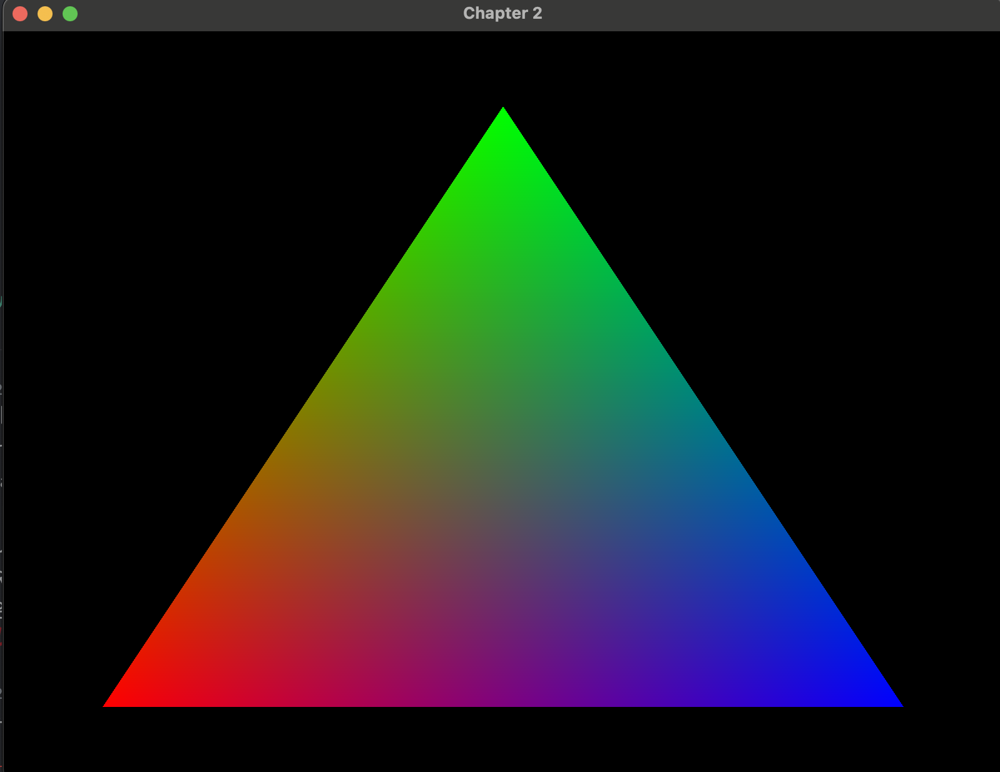

## opengl shader 만들기



다음과 같은 쉐이더를 만들기어 보도록 하겠다

이전 코드에 몇가지 문제가 있기 때문에 mac에 있는 openGL 라이브러리를 활용하기 위한 세팅을 하도록 하겠다

```makefile filepath='Makefile'
INCLUDES = -I /opt/homebrew/include
LIBPATHS = -L /opt/homebrew/lib

CFLAGS = -Wall -Wextra $(INCLUDES)

LIBS = $(LIBPATHS) -lGLEW -lglfw -framework OpenGL

SRCS = main.c shader.c

TARGET = openglstarter

all: $(TARGET)

$(TARGET): $(SRCS)
	$(CC) $(CFLAGS) $(SRCS) -o $(TARGET) $(LIBS)

clean:
	rm -f $(TARGET)
```

다음과 같이 ```-framework OpenGL``` 를 수정해주었으며 ```shader.c```를 추가해 주었다.

```c filepath='main.c'
#define GL_SILENCE_DEPRECATION

#include <stdlib.h>
#include <stdio.h>
#include <OpenGL/gl3.h>
#include <GLFW/glfw3.h>

#include "shader.h"

#define WINDOW_TITLE_PREFIX "Chapter 2"

int CurrentWidth = 800,
    CurrentHeight = 600;

GLFWwindow *window;

void Initialize(int, char *[]);
void InitWindow(int, char *[]);
void ResizeFunction(GLFWwindow *, int, int);
void RenderFunction(GLuint shaderProgram);

int main(int argc, char *argv[])
{
  // input 값 정의
  Initialize(argc, argv);

	// shader 프로그램 만들기
	GLuint shaderProgram = CreateShaderProgram();

  // VBO 생성
	CreateVBO();

  while (!glfwWindowShouldClose(window))
  {
    RenderFunction(shaderProgram);
		// event queue 마우스 키보드 등의 이벤트를 수신한다
    glfwPollEvents();
  }

	// vbo 제거
	DestroyVBO();

	//shader 프로그램 삭제
	DestroyShaderProgram(shaderProgram);

  // 화면 제거
  glfwDestroyWindow(window);
  // glfw 자원 회수
  glfwTerminate();

  exit(EXIT_SUCCESS);
}

void Initialize(int argc, char *argv[])
{
  InitWindow(argc, argv);

  fprintf(stdout, "INFO: OpenGL Version: %s\n", glGetString(GL_VERSION));

  glClearColor(0.0f, 0.0f, 0.0f, 0.0f);
}

void InitWindow(int argc, char *argv[])
{
	(void)argc;
	(void)argv;
  // opengl 기본정의
  if (!glfwInit())
  {
    fprintf(stderr, "ERROR: GLFW initialization failed\n");
    exit(EXIT_FAILURE);
  }

  // 맥스 버전
  glfwWindowHint(GLFW_CONTEXT_VERSION_MAJOR, 4);
  glfwWindowHint(GLFW_CONTEXT_VERSION_MINOR, 0);
  glfwWindowHint(GLFW_OPENGL_PROFILE, GLFW_OPENGL_CORE_PROFILE);

  // 창 생성
  window = glfwCreateWindow(CurrentWidth, CurrentHeight, WINDOW_TITLE_PREFIX, NULL, NULL);
  if (!window)
  {
    fprintf(stderr, "ERROR: Could not create a new rendering window.\n");
    glfwTerminate();
    exit(EXIT_FAILURE);
  }

  // 렌더링 시작
  glfwMakeContextCurrent(window);

  // 동기화 정의
  glfwSwapInterval(1); // V-Sync

  // 리사이즈 함수 등록
  glfwSetFramebufferSizeCallback(window, ResizeFunction);
}

void ResizeFunction(GLFWwindow *window, int Width, int Height)
{
	(void)window;

  CurrentWidth = Width;
  CurrentHeight = Height;
  glViewport(0, 0, CurrentWidth, CurrentHeight);
}

void RenderFunction(GLuint shaderProgram)
{
  glClear(GL_COLOR_BUFFER_BIT | GL_DEPTH_BUFFER_BIT);

	// shader program을 이용하여 그림 그리기
  glUseProgram(shaderProgram);
	// VAO선택
  glBindVertexArray(VAO);
	// bind된 VAO에 정의된 버텍스들의 index를 가지고 그리시 시작한다.
  glDrawArrays(GL_TRIANGLES, 0, 3);

  glBindVertexArray(0);

  glfwSwapBuffers(window);
}
```

main 은 추가적으로 ```shader program```을 만들고 ```VBO(Vertex Buffer Object)```를 추가할 수 있도록 코드를 추가하였다.
또한 렌더링 단계에서 ```shader program```을 bind하여 그리는 작업을 추가해 주었다

### 수정된 부분

- shader-program 생성
- VAO, VBO 생성,
- Rendering pipeline 추가

그럼 자세히 추가된 함수들을 알아 보도록 하겠다


```h filepath='shader.h'
// shader 생성

GLuint CreateShaderProgram();
void DestroyShaderProgram(GLuint shaderProgram);

GLuint VAO, VBO, ColorBuffer;

GLuint CreateVBO();
void DestroyVBO();
```

해더는 다음과 같은 함수와 변수를 선언해 주었다.

```c filepath='shader.c'
#define GL_SILENCE_DEPRECATION

#include <OpenGL/gl3.h>
#include <GLFW/glfw3.h>
#include <stdio.h>
#include <stdlib.h>

#include "shader.h"

const char *GlErrorString(GLenum errorCode)
{
  switch (errorCode)
  {
  case GL_NO_ERROR:
    return "No error has been recorded.";
  case GL_INVALID_ENUM:
    return "An unacceptable value is specified for an enumerated argument.";
  case GL_INVALID_VALUE:
    return "A numeric argument is out of range.";
  case GL_INVALID_OPERATION:
    return "The specified operation is not allowed in the current state.";
  case GL_OUT_OF_MEMORY:
    return "There is not enough memory left to execute the command.";
  default:
    return "Unknown error.";
  }
}
const char *vertexShaderSource = "#version 400 core\n"
                                 "layout(location = 0) in vec4 position;\n"
                                 "layout(location = 1) in vec4 in_Color;\n"
                                 "out vec4 ex_Color;\n"
                                 "void main() {\n"
                                 "    gl_Position = position;\n"
                                 "    ex_Color = in_Color;\n"
                                 "}\n";

const char *fragmentShaderSource = "#version 400 core\n"
                                   "in vec4 ex_Color;\n"
                                   "out vec4 out_Color;\n"
                                   "void main() {\n"
                                   "    out_Color = ex_Color;\n"
                                   "}\n";

GLuint createShader(GLenum shaderType, const char *shaderSource)
{
  GLuint shader = glCreateShader(shaderType);
  glShaderSource(shader, 1, &shaderSource, NULL);
  glCompileShader(shader);

  GLint success;
  glGetShaderiv(shader, GL_COMPILE_STATUS, &success);
  if (!success)
  {
    char infoLog[512];
    glGetShaderInfoLog(shader, 512, NULL, infoLog);
    fprintf(stderr, "ERROR: Shader compilation failed\n%s\n", infoLog);
    exit(-1);
  }
  return shader;
}

GLuint createProgram(GLuint vertexShader, GLuint fragmentShader)
{
  GLuint program = glCreateProgram();
  glAttachShader(program, vertexShader);
  glAttachShader(program, fragmentShader);
  glLinkProgram(program);

  GLint success;
  glGetProgramiv(program, GL_LINK_STATUS, &success);
  if (!success)
  {
    char infoLog[512];
    glGetProgramInfoLog(program, 512, NULL, infoLog);
    fprintf(stderr, "ERROR: Program linking failed\n%s\n", infoLog);
    exit(-1);
  }
  return program;
}


GLuint CreateShaderProgram()
{
  GLuint vertexShader, fragmentShader, shaderProgram;
  // 셰이더 프로그램 생성
  vertexShader = createShader(GL_VERTEX_SHADER, vertexShaderSource);
  fragmentShader = createShader(GL_FRAGMENT_SHADER, fragmentShaderSource);
  shaderProgram = createProgram(vertexShader, fragmentShader);

  glDeleteShader(vertexShader);
  glDeleteShader(fragmentShader);

  return shaderProgram;
};

void DestroyShaderProgram(GLuint shaderProgram)
{
  glDeleteProgram(shaderProgram);
}


/**
 * @brief 버텍스의 버퍼를 생성한다.
 */
GLuint CreateVBO()
{
  // 정점 데이터이다
  GLfloat vertices[] = {
      -0.8f, -0.8f, 0.0f, 1.0f,
      0.0f, 0.8f, 0.0f, 1.0f,
      0.8f, -0.8f, 0.0f, 1.0f};

  // 색 데이터 이다.
  GLfloat colors[] = {
      1.0f, 0.0f, 0.0f, 1.0f,
      0.0f, 1.0f, 0.0f, 1.0f,
      0.0f, 0.0f, 1.0f, 1.0f};

  // VAO 갯수와 주소를 전달하여 array생성
  glGenVertexArrays(1, &VAO);

  // Bind할 VAO array를 선택한다
  glBindVertexArray(VAO);

  // VAO array에 정점 정의

  // 생성할 갯수와 주소를 담을 객체를 전달하여 버퍼 생성
  glGenBuffers(1, &VBO);

  // 바인딩 과정(동기화 과정) 이 있다고 한다
  glBindBuffer(GL_ARRAY_BUFFER, VBO);

  // 정점에 대한 데이터를 업데이트 해줍니다.
  glBufferData(GL_ARRAY_BUFFER, sizeof(vertices), vertices, GL_STATIC_DRAW);

  // 정점 데이터 (VBO)
  glVertexAttribPointer(0, 4, GL_FLOAT, GL_FALSE, 4 * sizeof(GLfloat), (GLvoid *)0);
  // 정점을 index를 정의하여 활성화 한다.
  glEnableVertexAttribArray(0);

  // 정점 정의 끝

  // 색 정의
  glGenBuffers(1, &ColorBuffer);
  glBindBuffer(GL_ARRAY_BUFFER, ColorBuffer);
  glBufferData(GL_ARRAY_BUFFER, sizeof(colors), colors, GL_STATIC_DRAW);
  glVertexAttribPointer(1, 4, GL_FLOAT, GL_FALSE, 4 * sizeof(GLfloat), (GLvoid *)0);

  glEnableVertexAttribArray(1);

  // 설정 끝
  glBindBuffer(GL_ARRAY_BUFFER, 0); // VBO unbind 설정
  glBindVertexArray(0);             // VAO unbind 설정

  GLenum ErrorCheckValue = glGetError();
  if (ErrorCheckValue != GL_NO_ERROR)
  {
    fprintf(
        stderr,
        "ERROR: Could not create a VBO: %s \n",
        GlErrorString(ErrorCheckValue));
    exit(-1);
  }

  return (VAO); 
}

void DestroyVBO()
{

  glBindBuffer(GL_ARRAY_BUFFER, 0);
  glBindVertexArray(0);

  // 정점 비활성화
  glDisableVertexAttribArray(0);
  // 색 비활성화
  glDisableVertexAttribArray(1);

  // 버퍼 삭제
  glDeleteBuffers(1, &ColorBuffer);
  glDeleteBuffers(1, &VBO);

  // VAO array 삭제
  glDeleteVertexArrays(1, &VAO);

  GLenum ErrorCheckValue = glGetError();
  if (ErrorCheckValue != GL_NO_ERROR)
  {
    fprintf(
        stderr,
        "ERROR: Could not destroy the VBO: %s \n",
        GlErrorString(ErrorCheckValue));
    exit(-1);
  }
}
```

상위와 같은 코드를 정의하였으며 이는 ```OpenGL version 3```를 위한 코드로 제작되었다.

> [!WARNING]
> 해더의 경우 ```<GLFW/glfw3.h>```에서 ```OpenGL/gl.h```을 호출 하기에 ```OpenGL/gl3.h```를 먼저 선언한후 ```GLFW/glfw3.h```를 호출 하도록 한다.


### ShaderSource 정의

```c 
const char vertexShaderSourc;
const char fragmentShaderSource;
```

상위 2 변수의 경우 shader에 따라 실행할 쉐이더 프로그램의 정의 이다

#### vertex

| **코드 부분**                            | **설명**                                                                                                                                                  |
| ---------------------------------------- | --------------------------------------------------------------------------------------------------------------------------------------------------------- |
| `#version 400 core`                      | OpenGL Shading Language (GLSL)의 버전 400을 사용하며, core 프로파일을 지정합니다.                                                                         |
| `layout(location = 0) in vec4 position;` | 정점 위치를 나타내는 `position` 변수를 입력으로 받습니다. 이 변수는 `vec4` 타입으로 bind되길 기다리는 변수입니다.                                         |
| `layout(location = 1) in vec4 in_Color;` | 정점 색상을 나타내는 `in_Color` 변수를 입력으로 받습니다. 이 변수도 `vec4` 타입으로 bind되길 기다리는 변수입니다.                                         |
| `out vec4 ex_Color;`                     | **Vertex Shader**의 출력 변수인 `ex_Color`를 정의합니다. 이 변수는 **Fragment Shader**로 전달될 색상 값을 저장합니다.                                     |
| `void main()`                            | **Vertex Shader**의 main 함수의 시작입니다.                                                                                                               |
| `gl_Position = position;`                | `gl_Position`은 OpenGL의 내장 변수로, 최종적으로 화면에 그려질 정점의 위치를 설정합니다. `position` 값을 `gl_Position`에 할당하여 화면 좌표를 결정합니다. |

이렇게 구분할수 있다
이중 **내장변수** ```gl_Position```과  **Fragment Shader** ```ex_Color```가 내부적으로 작동 하게 한다는 것을 알 수 있다.

이러한 location = 0 과 같은 부분은 
```c
  // 정점에 대한 데이터를 업데이트 해줍니다.
  glBufferData(GL_ARRAY_BUFFER, sizeof(vertices), vertices, GL_STATIC_DRAW);
  // 정점 데이터 (VBO)
  glVertexAttribPointer(0, 4, GL_FLOAT, GL_FALSE, 4 * sizeof(GLfloat), (GLvoid *)0);
  // 정점을 index를 정의하여 활성화 한다.
  glEnableVertexAttribArray(0);
```

과 같이 ```0```  <-index 를 알려주는것으로 데이터를 전달한다고 볼수 있다.

이렇게 서로의 변수의 값을 동기화 하는것을 볼 수 있다.

#### fragment

최종적으로 픽셀을 그려주기 위한 작업이다

전달받은 ```ex_Color```를 최종적으로 출력하는 것을 볼 수 있다.

```c
"#version 400 core\n"
"in vec4 ex_Color;\n"
"out vec4 out_Color;\n"
"void main() {\n"
"    out_Color = ex_Color;\n"
"}\n";
```

| **코드 부분**           | **설명**                                                                                                              |
| ----------------------- | --------------------------------------------------------------------------------------------------------------------- |
| `#version 400 core`     | OpenGL Shading Language (GLSL)의 버전 400을 사용하며, core 프로파일을 지정합니다.                                     |
| `in vec4 ex_Color;`     | **Vertex Shader**에서 전달된 `ex_Color` 값을 입력으로 받습니다. 이 값은 색상 정보를 담고 있는 `vec4` 타입 변수입니다. |
| `out vec4 out_Color;`   | **Fragment Shader**의 출력 변수인 `out_Color`를 정의합니다. 이 변수는 최종적으로 화면에 표시될 색상 값입니다.         |
| `void main()`           | **Fragment Shader**의 main 함수의 시작입니다.                                                                         |
| `out_Color = ex_Color;` | **Fragment Shader**에서 받은 `ex_Color` 값을 `out_Color`에 할당하여 최종 색상을 설정합니다.                           |


#### shader 만들기


```c
GLuint shader = glCreateShader(GL_***_SHADER);
glShaderSource(shader, 1, &shaderSource, NULL);
glCompileShader(shader);
```

다음과 같이 shader를 정의된 코드를 전달하여 만들어 줄 수 있다.  
이는 독립된 프로그램으로 실행하게 한다.

#### shader 프로그램 만들기

```c
glAttachShader(program, vertexShader);
glAttachShader(program, fragmentShader);
glLinkProgram(program);
```

만들어진 쉐이더 프로그렘을 병렬 파이프라인을 만드는 과정이다

이렇게 모든 shader 프로그램을 병렬로 돌 수 있고 서로의 데이터를 공유할 수 있도록 환경을 세팅하였다.

또한 이렇게 만든 프로그램의 경우

```c
void DestroyShaderProgram(GLuint shaderProgram)
{
  glDeleteProgram(shaderProgram);
}
```

상위와 같이 지워주는 것으로 리소스를 다시 확보할 수 있다.

> [!NOTE]
> ```glDeleteShader(vertexShader)```, ```glDeleteShader(fragmentShader)```를 program을 만들고 삭제한 이유는  
> 셰이더 객체는 프로그램에 첨부되면 더 이상 필요하지 않기 때문에, 프로그램에 셰이더를 첨부한 후에는 메모리 관리 측면에서 ```glDeleteShader()```를 사용하여 삭제해도 문제가 없다.

### VAO(Vertex Array Object), VBO(Vertex Buffer Object)

#### VAO
VAO는 여러 개의 VBO와 그 상태를 하나의 객체로 묶는 역할을 한다.


```c
// VAO 갯수와 주소를 전달하여 array생성
glGenVertexArrays(1, &VAO);
```

이와같이 갯수를 생성할 수 있다.

또한 선택을 하는 방법은 

```c
// Bind할 VAO array를 선택한다
glBindVertexArray(VAO);
```
이와 같이 원하는 VAO를 선택하여 사용 준비를 할 수 있다.

#### VBO
정점 데이터를 GPU 메모리로 전송하기위한 객체이다.

최종적인 목적은 CPU와 GPU간 데이터 이동을 최소화 하기 위한 작업이다.

VBO또한 생성을 하여 사용을 해야한 다

```c
// 생성할 갯수와 주소를 담을 객체를 전달하여 버퍼 생성
glGenBuffers(1, &VBO);

// 바인딩 과정(동기화 과정) 이 있다고 한다
glBindBuffer(GL_ARRAY_BUFFER, VBO);

// 정점에 대한 데이터를 업데이트 해줍니다.
glBufferData(GL_ARRAY_BUFFER, sizeof(vertices), vertices, GL_STATIC_DRAW);

// 정점 데이터 (VBO)
glVertexAttribPointer(0, 4, GL_FLOAT, GL_FALSE, 4 * sizeof(GLfloat), (GLvoid *)0);
```

이과 같이 생성과 선택을 해주고 생성하여 필요에 맞는 정의를 해주는 것으로 상위에서 정의한 프로그램에 맞는 변수의 값을 넣어줄 수 있다.

##### glBufferData()

```glBufferData()``` 함수의 경우 지정된 버퍼 객체에 데이터를 복사하는 것을 목적으로 한다.

| **매개변수** | **설명**                         |
| ------------ | -------------------------------- |
| `target`     | 버퍼의 타입을 지정합니다.        |
| `size`       | 저장할 데이터의 크기입니다.      |
| `data`       | 버퍼에 저장할 실제 데이터입니다. |
| `usage`      | 데이터의 용도를 지정합니다.      |

타입은 다음과 같은 속성을 가지고 있다

| **버퍼 타입**                  | **목적**                       | **설명**                                                                            |
| ------------------------------ | ------------------------------ | ----------------------------------------------------------------------------------- |
| `GL_ARRAY_BUFFER`              | 정점 데이터 저장               | 주로 정점 데이터를 저장하며, 정점 배열 객체(VAO)와 함께 사용됩니다.                 |
| `GL_ELEMENT_ARRAY_BUFFER`      | 인덱스 데이터 저장             | 정점 순서를 지정하는 인덱스를 저장하여, 버텍스 재사용을 가능하게 합니다.            |
| `GL_UNIFORM_BUFFER`            | Uniform 데이터 저장            | 셰이더에 전달되는 상수 값들을 저장하며, 여러 셰이더에서 공유할 수 있습니다.         |
| `GL_TEXTURE_BUFFER`            | 텍스처 데이터 저장             | 텍스처 데이터를 버퍼 형태로 저장하여 셰이더에서 데이터 배열처럼 사용할 수 있습니다. |
| `GL_TRANSFORM_FEEDBACK_BUFFER` | 변환 피드백 데이터 저장        | 변환 피드백을 통해 셰이더에서 처리된 정점 데이터를 버퍼에 저장합니다.               |
| `GL_PIXEL_PACK_BUFFER`         | 픽셀 데이터 GPU에서 CPU로 복사 | GPU에서 CPU로 픽셀 데이터를 복사할 때 사용됩니다.                                   |
| `GL_PIXEL_UNPACK_BUFFER`       | 픽셀 데이터 CPU에서 GPU로 복사 | CPU에서 GPU로 픽셀 데이터를 복사할 때 사용됩니다.                                   |

##### glVertexAttribPointer()

```glVertexAttribPointer()```는 상위에 정의된 souce code 에 전달될 변수의 정보가 담기기 때문에 상위 program을 만들때 사용한 코드를 고려하여 작업하여야한다.

> [!WARNING]
> ```index``` 가 같지않으면 찾을 수 없음으로 주의하여야 한다.

| 매개변수     | 설명                                                                                                                                 |
| ------------ | ------------------------------------------------------------------------------------------------------------------------------------ |
| `index`      | 정점 속성의 인덱스입니다. 예를 들어, `0`은 첫 번째 정점 속성, `1`은 두 번째 속성입니다.                                              |
| `size`       | 속성에 포함된 값의 개수입니다. 예를 들어, `3`은 3D 좌표를 의미하고, `4`는 색상의 RGBA 값을 나타냅니다.                               |
| `type`       | 데이터의 타입을 지정합니다. 예를 들어, `GL_FLOAT`는 실수형 데이터를 의미합니다.                                                      |
| `normalized` | 데이터가 정규화되어야 하는지 여부를 지정합니다. `GL_TRUE`는 정규화된 데이터를 의미하며, `GL_FALSE`는 그렇지 않음을 의미합니다.       |
| `stride`     | 속성 데이터 간의 간격을 지정합니다. `0`은 속성이 연속된 메모리 공간에 있을 때 사용하며, 각 속성이 나란히 저장되는 경우에 유용합니다. |
| `pointer`    | 버퍼에서 데이터가 시작되는 주소입니다. 이 주소는 `glBufferData`로 설정된 버퍼에서 데이터를 지정합니다.                               |

이와같이 정의하는 방법에 대하여 알아보았다.


#### VAO VBO 할당 제거

할당 제거는 다음과 같은 순서를 고려하며 작업해야한다

1. 활성화 상태가 아니도록 설정
2. buffer를 사용하지 않는 상태로 설정
3. VBO 제거
4. VAO 제거

이러한 작업을 고려하며 역순으로 할당을 해제해주면 될 거 같다.
