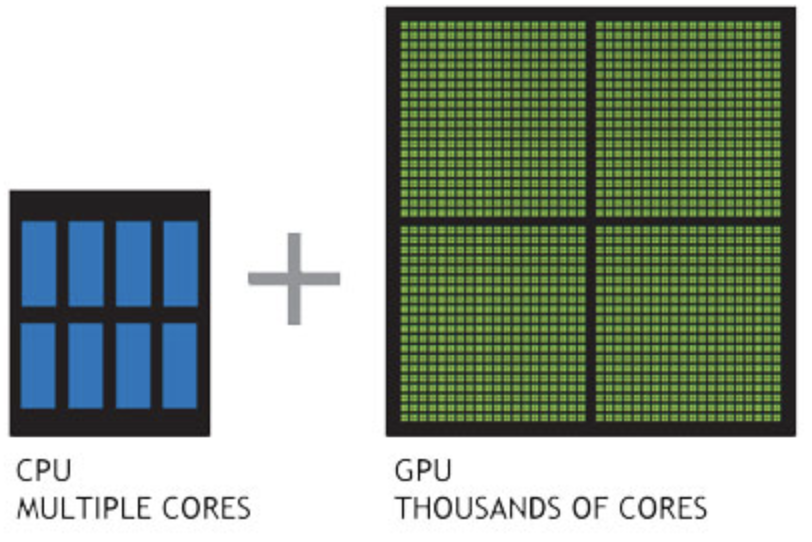

## shader란 


> [!NOTE]
> shade + er = Shader 

```shader```는 다음과 같은 기능을 하는것을 정의한다

-  셰이더는 그래픽스의 시각적 효과를 제어
-  렌더링 파이프라인에 다양한 처리를 하여 반환한다
-  GPU에서 실행되어 매우 빠르게 작동할 수 있다.

### 셰이더의 종류

1. 버텍스 셰이더
2. 프래그먼트 쎄이더
3. 지오메트리 셰이더
4. 테셀레이션 쎄이더
5. 컴퓨팅 셰이더
   
> [!WARNING]
> 추가 내용을 기입할 예정입니다.


### 셰이더의 동작 원리

셰이더는 그래픽스 API를 사용하여 GPU에서 실행되는 프로그램이다.

대표적인 프로그램으로는 GLSL, HLSL 이 있다.

> [!NOTE]
> Vertex란?   
> `정점`으로 표기하며 3D공간의 위치와 방향을 가지는 텍스처 데이터이다.  
> 모델링을 하기위한 중요한 정보이다

| 🤔 셰이더는 왜 빠른것인가?



셰이더는 다음과 같은 간단한 연산을 다중적으로 하는것이 많다. (백터연산, 곱 더하기 )  
하지만 CPU의 경우 적은 처리를 위한 데이터를 불러오거나 스케줄링하는 부분에서 시간이 더욱 들기에 이러한 부분은 gpu에서 하는것이 좋은것이다.  
또한 gpu에는 특정 수학연산이 바로 가능하게끔 트렌지스터를 구성하여 보다 빠른 처리가 가능하다.

## glsl는 무엇인가

glsl는 opengl shading language의 줄임말이다 

glsl에 대하여 다른 doc에서 자세히 살펴보도록 하겠다.


## 쉐이더로 만들어보기

